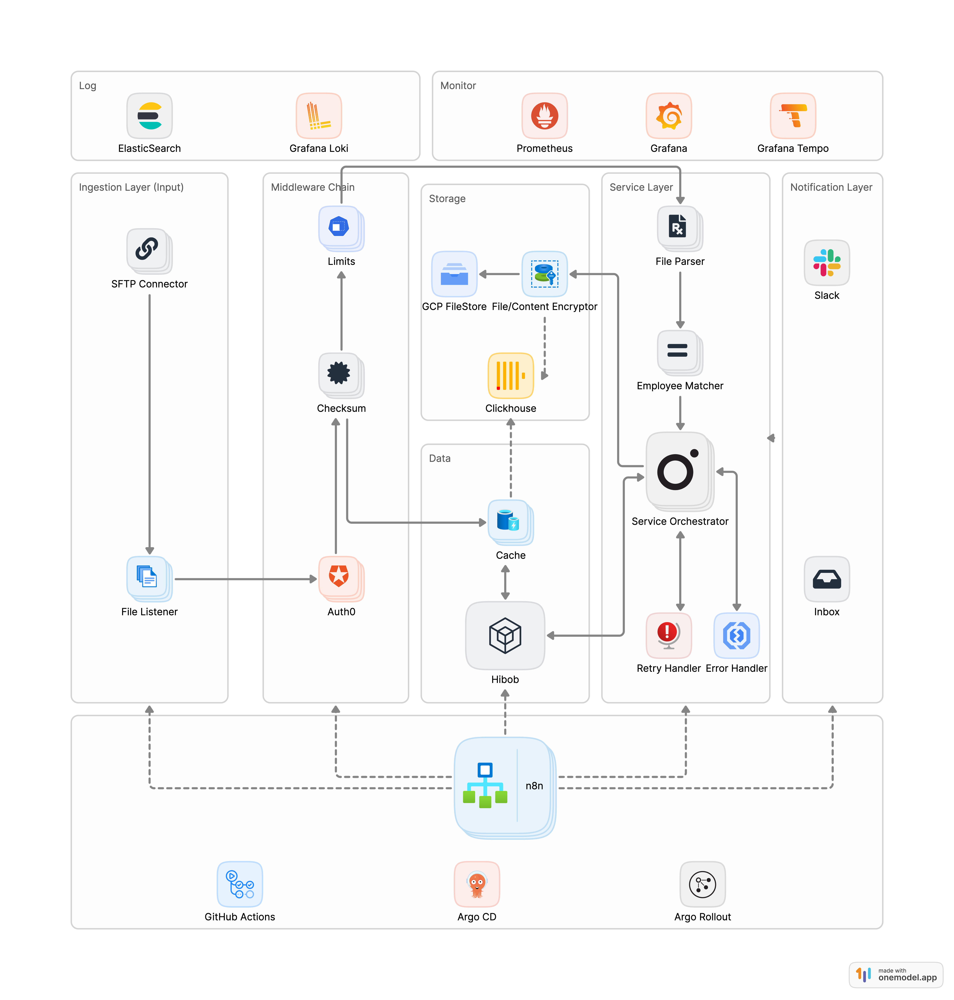

# SFTP → HiBob Payslip Automation — Architecture & Design

## 1. Problem & Goals
HR currently receives monthly payslips from an external payroll provider through SFTP and manually uploads them into **HiBob**, causing delays, duplication, and operational risk.

The goal is to design and implement a **secure, reliable, and observable** automation pipeline that ingests payslips, validates integrity, matches employee data, and uploads results to HiBob automatically.

**Objectives**
- Automate SFTP-to-HiBob data flow with validation and retries
- Ensure data **integrity** (checksum verification) and **idempotency** (deduplication)
- Maintain **auditability**, **error resilience**, and **observability**
- Demonstrate production-grade design with modular, testable components

---

### Architecture Diagram Caption

The diagram below illustrates an **end-to-end payslip automation pipeline** with layered orchestration, reliability controls, and observability hooks.



**Flow Summary**
1. **Ingestion Layer** — Local SFTP folder (mocked) acts as entry point.
    - Watches `/data/payslips/` for new files (`EMPID_YYYYMM.pdf`).
    - Emits events for each file.
2. **Integrity & Dedup Layer** —
    - Calculates SHA256 checksum to guarantee integrity.
    - Uses Redis cache to prevent duplicate re-uploads.
3. **Matching Layer** —
    - Extracts metadata from filenames (employee, date).
    - Matches against mock HiBob directory (`employees.json`).
4. **Upload Orchestrator** —
    - Invokes mock `HiBob API` (simulated REST call).
    - Applies **retry policy** with exponential backoff.
    - Handles partial failures gracefully.
5. **Storage Layer** —
    - Mock-encrypts and archives validated files to `data/archive/`.
    - Guarantees traceability (filename, checksum, trace_id).
6. **Notification Layer** —
    - Sends mock Slack or email alerts for each upload outcome.
    - Aggregates summary per batch.
7. **Observability & FinOps Layer** —
    - Tracks metrics (success/fail/dedup/retries).
    - Logs structured JSON with trace_id and timestamps.
    - Simulates cost analytics via ClickHouse.

---

## 2. Component Breakdown

| Layer | Component | Description |
|--------|------------|-------------|
| **Ingestion** | `sftp_listener.py` | Polls local folder as SFTP source. |
| **Integrity** | `checksum_util.py` | Calculates SHA256 checksum for deduplication & validation. |
| **Cache** | `cache.py` | Redis wrapper (in-memory fallback) for processed files. |
| **Matching** | `hibob_api_mock.py` | Mock HiBob API for employee lookup & upload. |
| **Orchestration** | `orchestrator.py` | Controls workflow, logging, trace_id, retry handling. |
| **Retry** | `retry_handler.py` | Implements exponential backoff retry for transient errors. |
| **Notification** | `notifications.py` | Mock Slack/Email alerts for visibility. |
| **Storage** | `storage_mock.py` | Mock encryption & archive persistence. |
| **Metrics** | `metrics.py` | Collects counters for upload success/failure. |
| **Logging** | `logger.py` | Structured JSON logging with timestamps and trace_id. |
| **Analytics Sink** | `clickhouse` (mock) | Future-ready FinOps & audit metrics store. |

---

## 3. Security & Governance

| Control Area | Description |
|---------------|--------------|
| **Data Integrity** | SHA256 checksum verified per file to prevent tampering. |
| **Deduplication** | Redis tracks processed checksums (idempotent uploads). |
| **Authentication** | Mocked — replaceable with SFTP keys and HiBob OAuth tokens. |
| **Error Handling** | Retries transient failures; fails safely on repeated errors. |
| **Audit Logging** | JSON logs with `trace_id` and timestamps for each file. |
| **Data Privacy** | Local mock only — no real employee data stored. |
| **Storage Security** | Archive simulates AES encryption before persistence. |

---

## 4. Reliability & Observability

### Metrics
| Metric | Description |
|---------|-------------|
| `upload_success_total` | Successful mock uploads |
| `hibob_upload_fail_total` | Simulated HiBob API failures |
| `dedup_skipped_total` | Duplicate files ignored |
| `employee_not_found_total` | Files without employee match |
| `upload_final_fail_total` | Retries exhausted |

### Logging
- **Structured JSON** via Loguru
- Includes: `trace_id`, `file`, `checksum`, `status`, `duration`, `message`
- Compatible with ELK / Grafana Loki ingestion.

### FinOps Readiness
- Cost mock events exported to ClickHouse.
- Supports future Prometheus → Grafana integration.
- Enables cost per upload, retry count, and SLA visibility.

---

## 5. Scalability & Extensibility

| Capability | Description |
|-------------|-------------|
| **Stateless Workers** | Each run independent; Redis used for shared cache. |
| **Horizontal Scaling** | Multiple containers can process batches concurrently. |
| **Idempotency** | Checksum ensures “exactly-once” semantics. |
| **Retry Strategy** | Exponential backoff for HiBob transient failures. |
| **Multi-Region Support** | Extend by sharding employee datasets per region. |
| **Observability Hooks** | Trace_id, metrics, and logs easily exportable. |
| **Pluggable Connectors** | Extend to S3, GDrive, or HRIS easily. |

---

## 6. Local Run & Testing Guide

### 6.1 Quick Start
```bash
python -m venv .venv
source .venv/bin/activate
pip install -r requirements.txt
docker compose up -d   # Redis + ClickHouse
```

### 6.2 Generate Demo Payslips
```bash
python tools/seed_demo_files.py
```

### 6.3 Run the Pipeline
```bash
python main.py run --input data/payslips
```

### 6.4 Simulate Failures & Retries
```bash
python main.py run --input data/payslips --fail-rate 0.3
```

### 6.5 Clean Cache
```bash
python python -m tools.clear_cache
```

## 7. Sample Output
```json
{"event":"processing_start","trace_id":"b9a1f3","file":"data/payslips/EMP001_202510.pdf"}
{"event":"hibob_upload_ok","hibob_id":"HB001","file":"EMP001_202510.pdf"}
{"event":"archive_written","path":"data/archive/EMP001_202510.pdf"}
{"event":"slack_notify","text":"✅ Uploaded EMP001_202510.pdf"}
```
## 8. Design Trade-offs

| Choice                     | Reason                                        |
|----------------------------|-----------------------------------------------|
| `Code-first orchestration` | Fine-grained error control and retries        |
| `Checksum dedup`           | Guarantees idempotency an audit safety        |
| `Redis Cache`              | Enables multi-worker scaling & fast lookup    |
| `ClickHouse sink`          | Future-ready analytics & FinOps observability |

## 9. Summary

This project demonstrates:
- Security — checksum integrity & controlled retries
- Scalability — stateless design with Redis coordination
- Reliability — exponential backoff and idempotent uploads
- Observability — metrics, logs, trace_id for full auditability
- FinOps Awareness — cost and performance transparency

A production-ready automation blueprint that reflects real-world enterprise reliability, designed for clarity, extensibility, and operational insight.

